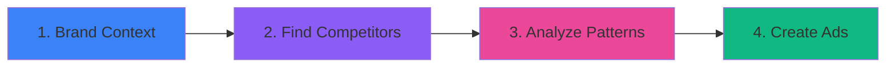

# 🎯 Ads AI

> AI-powered ad creation tool that studies your competitors' proven ads and generates new ad concepts for your brand.

[](https://nextjs.org/)
[](https://www.typescriptlang.org/)
[](LICENSE)

## ✨ What It Does

Ads AI finds advertisers spending real money in your space, analyzes what's working, and creates ad copy + visuals that replicate winning strategies. Works for **any brand in any niche**.

### Key Features

- 🔍 **Competitor Discovery** — Search Meta Ad Library by keywords, rank advertisers by real spending signals
- 🧠 **Pattern Analysis** — AI identifies winning hooks, copy structures, and visual approaches from top-performing ads
- ✍️ **Ad Generation** — Creates ad concepts with AI-written copy (Claude) and AI-generated images (Kie.ai)
- 🎬 **Video Support** — Generates scene-by-scene video scripts for video ad concepts
- ⚡ **Quality Control** — Automatic evaluation ensures brand consistency before showing results
- 🎨 **Modern UI** — Dark glass-morphism design with smooth animations

## 🚀 Quick Start

### Prerequisites

- Node.js 18+
- API keys (see [Environment Setup](#-environment-setup))

### Installation

```bash
# Clone the repository
git clone https://github.com/yourusername/ads-ai.git
cd ads-ai

# Set up environment variables
cp .env.example .env
# Edit .env and add your API keys

# Install dependencies
cd app
npm install

# Start development server
npm run dev

# Open in browser
open http://localhost:3000
```

## 🔑 Environment Setup

Create a `.env` file in the project root with the following API keys:

| Variable | Purpose | Get Key |
|----------|---------|---------|
| `ANTHROPIC_API_KEY` | Claude AI for ad generation & analysis | [Get Key](https://console.anthropic.com/) |
| `GEMINI_API_KEY` | Gemini for visual analysis | [Get Key](https://aistudio.google.com/apikey) |
| `APIFY_API_TOKEN` | Meta Ad Library scraping | [Get Key](https://console.apify.com/account/integrations) |
| `KIE_AI_API_KEY` | AI image generation | [Get Key](https://kie.ai/) |
| `FIRECRAWL_API_KEY` | Website scraping (optional) | [Get Key](https://firecrawl.dev/) |

## 📖 How It Works

### 4-Stage Flow



#### Stage 1: Collect Brand Context
- Enter your website URL or use Claude Code's `/collect-brand` command
- Tool crawls site, extracts products, analyzes visuals
- Gemini AI analyzes brand images/videos for visual style
- **Output:** `brand-context.json`, product catalog, brand assets

#### Stage 2: Find Competitors
- Auto-suggests keywords from brand context
- Searches Meta Ad Library in parallel batches
- Ranks advertisers by days running, ad count, creative diversity
- **Output:** `search-results.json`, competitor ad database

#### Stage 3: Analyze What's Working
- Claude analyzes top 25 competitor ads
- Identifies winning hooks with effectiveness ratings
- Extracts 5-8 recurring patterns (copy, visuals, emotional angles)
- **Output:** `analysis.json` with actionable insights

#### Stage 4: Create Your Ads
- Dynamically pairs top competitor ads with your products
- Generates concepts in parallel (1-30 at a time)
- Format-aware: video ads → video scripts, static ads → static concepts
- Quality control filters out low-quality results
- **Output:** `concepts.csv`, AI-generated images

## 🎯 Use Cases

- **Ecommerce Brands** — Generate product ad concepts from competitor research
- **Agencies** — White-label tool for multiple clients
- **Content Creators** — Analyze what's working in your niche
- **Marketers** — Rapid ad testing and iteration

## 📊 Data Flow

All data is stored locally in the `/data` folder:

```
data/
├── brand-context.json      # Stage 1: Brand profile
├── products.csv            # Product catalog
├── search-results.json     # Stage 2: Competitor rankings
├── meta-ads.csv            # Scraped competitor ads
├── analysis.json           # Stage 3: Winning patterns
├── concepts.csv            # Stage 4: Generated concepts
├── brand-assets/           # Downloaded brand images
├── competitor-ads/         # Competitor ad images
└── generated-images/       # AI-generated ad images
```

## 🛠️ Tech Stack

- **Framework:** Next.js 15, React, TypeScript
- **UI:** Tailwind CSS, shadcn/ui, glass-morphism design
- **AI Models:** 
  - Claude (Anthropic) — ad copy generation, analysis
  - Gemini (Google) — visual analysis
  - Kie.ai — image generation
- **Data Sources:** Meta Ad Library (via Apify), FireCrawl
- **Storage:** JSON + CSV file-based storage
- **Testing:** Vitest (33 unit tests)

## 📁 Project Structure

```
ads-ai/
├── app/                    # Next.js application
│   ├── src/
│   │   ├── app/            # Pages & API routes
│   │   ├── components/     # React components
│   │   ├── lib/            # Business logic & API integrations
│   │   └── hooks/          # Custom React hooks
│   └── vitest.config.ts    # Test configuration
├── data/                   # Runtime data storage
├── .claude/                # Claude Code commands
├── plans/                  # Implementation plans
└── GETTING-STARTED.md      # Detailed setup guide
```

## 🧪 Testing

```bash
cd app
npx vitest run    # Run 33 unit tests
```

## 📚 Documentation

- **[GETTING-STARTED.md](GETTING-STARTED.md)** — Complete setup walkthrough
- **[CLAUDE.md](CLAUDE.md)** — Technical architecture & AI integration
- **[TEST-QUICK-START.md](TEST-QUICK-START.md)** — Testing guide

## 🎨 Screenshots

### Brand Context Page
View your brand profile with collapsible products and visuals sections.

### Competitor Discovery
Search Meta Ad Library, see advertiser rankings with performance metrics.

### Pattern Analysis
AI-identified winning hooks with effectiveness ratings and thumbnails.

### Ad Creation
Side-by-side comparison: reference ad → your generated concept.

## 🤝 Contributing

Contributions are welcome! Please feel free to submit a Pull Request.

## 📄 License

MIT License - see [LICENSE](LICENSE) file for details

## 🙏 Acknowledgments

- Built with Claude AI assistance
- Uses Meta Ad Library data
- Powered by multiple AI services (Anthropic, Google, Kie.ai)

## 📞 Support

- **Issues:** [GitHub Issues](https://github.com/yourusername/ads-ai/issues)
- **Documentation:** See `GETTING-STARTED.md` for detailed setup

---

**Made with ❤️ for marketers and agencies**
