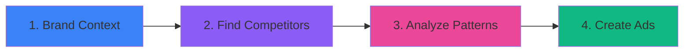

# 🎯 AdLaunch AI

> AI-powered ad creation tool that studies your competitors' proven ads and generates new ad concepts for your brand — now with multi-user accounts, multi-brand support, and a full marketing site.

[](https://nextjs.org/)
[](https://www.typescriptlang.org/)
[](https://supabase.com/)
[](LICENSE)

## ✨ What It Does

AdLaunch AI finds advertisers spending real money in your space, analyzes what's working, and creates ad copy + visuals that replicate winning strategies. Works for **any brand in any niche** — and now supports multiple users, each managing multiple client brands, with usage-based billing.

### Key Features

- 🔍 **Competitor Discovery** — Search Meta Ad Library by keywords, rank advertisers by real spending signals (30+ days running = proven, not a guess)
- 🧠 **Pattern Analysis** — AI identifies winning hooks, copy structures, and visual approaches from top-performing ads, including exact hook technique and psychology
- ✍️ **Ad Generation** — Creates ad concepts with AI-written copy (Claude) and AI-generated images (Kie.ai), sized to match your reference ad's exact aspect ratio
- 🎬 **Video Support** — Generates scene-by-scene video scripts for video ad concepts
- ⚡ **Quality Control** — Every concept is scored (brand consistency, copy quality, strategic relevance) before you see it — invisible gate, only 6.0/10+ passes
- 📺 **YouTube Brand Analysis** — Optional YouTube channel analysis (configurable video count) feeds into brand tone/audience/messaging
- 👥 **Multi-User Accounts** — Supabase-backed auth with full row-level security
- 🏢 **Multi-Brand Support** — One account, multiple isolated brands (built for agencies managing several clients)
- 🕐 **Concept History & Versioning** — Every generation run is a browsable, timestamped batch; regenerate a concept and keep a link back to what it was refined from
- 🎨 **Modern UI** — Dark glass-morphism design with smooth animations

## 🚧 Feature Status

This project has grown significantly beyond the original single-user tool. Status below reflects what's live vs. designed-but-pending, so this README doesn't overclaim:

| Feature | Status |
|---|---|
| Core 4-stage pipeline (brand → competitors → analysis → create) | ✅ Live |
| Multi-user authentication (Supabase Auth + RLS) | ✅ Live |
| Multi-brand support (switch between client brands) | ✅ Live |
| Concept history / batch timeline / versioning | ✅ Live |
| Configurable YouTube video count for brand analysis | ✅ Live |
| Marketing site (`/`, `/how-it-works`) | ✅ Live |
| Pricing page (`/pricing`) | 🚧 In progress |
| Account page (`/account`) | 🚧 In progress |
| Single-concept export (download image / copy ad copy) | 📋 Spec'd, not yet built |
| Batch export (zip of images + copy) | 📋 Spec'd, not yet built |
| Meta Ads Manager bulk-import export | 📋 Spec'd, not yet built |
| Image storage on Supabase Storage (replacing local-disk save) | 📋 Spec'd — needed before export ships reliably on Vercel |
| Billing (Dodo Payments) + credits system | 📋 Spec'd, not yet built |
| Admin panel (user/usage visibility) | 📋 Spec'd — intentionally sequenced *after* billing, since subscription status should be set by real payment webhooks, not hand-edited |

## 🚀 Quick Start

### Prerequisites

- Node.js 18+
- A Supabase project (Auth + Postgres + Storage)
- API keys (see [Environment Setup](#-environment-setup))

### Installation

```bash
# Clone the repository
git clone https://github.com/kmurdhar3/ads-ai-main.git
cd ads-ai-main

# Set up environment variables
cp .env.example .env
# Edit .env and add your API keys + Supabase credentials

# Install dependencies
cd app
npm install

# Run Supabase migrations (see supabase/migrations/)
# Apply via the Supabase dashboard SQL editor or CLI

# Start development server
npm run dev

# Open in browser
open http://localhost:3000
```

## 🔑 Environment Setup

Create a `.env` file in the project root with the following:

| Variable | Purpose | Get Key |
|----------|---------|---------|
| `ANTHROPIC_API_KEY` | Claude AI for ad generation & analysis | [Get Key](https://console.anthropic.com/) |
| `GEMINI_API_KEY` | Gemini for visual analysis | [Get Key](https://aistudio.google.com/apikey) |
| `APIFY_API_TOKEN` | Meta Ad Library + Instagram + YouTube scraping | [Get Key](https://console.apify.com/account/integrations) |
| `KIE_AI_API_KEY` | AI image generation | [Get Key](https://kie.ai/) |
| `FIRECRAWL_API_KEY` | Website scraping (optional) | [Get Key](https://firecrawl.dev/) |
| `NEXT_PUBLIC_SUPABASE_URL` | Supabase project URL | [Supabase Dashboard](https://supabase.com/dashboard) |
| `NEXT_PUBLIC_SUPABASE_ANON_KEY` | Supabase anon/public key | [Supabase Dashboard](https://supabase.com/dashboard) |
| `SUPABASE_SERVICE_ROLE_KEY` | Server-only, used for admin-level operations | [Supabase Dashboard](https://supabase.com/dashboard) |
| `DODO_WEBHOOK_SECRET` | Billing webhook signature verification (case-sensitive) | [Dodo Payments](https://dodopayments.com/) — *pending, see Feature Status* |

## 📖 How It Works

### 4-Stage Flow



#### Stage 1: Collect Brand Context
- Enter your website URL, or optionally add an Instagram handle and/or YouTube channel — or use Claude Code's `/collect-brand` command for a more flexible input (URLs, files, keywords, descriptions)
- Crawls your site, extracts products, downloads brand visuals
- Optional YouTube analysis: pulls N most recent videos (configurable, default 3) and analyzes tone, themes, audience via Claude
- Gemini AI analyzes brand images/videos for visual style
- **Output:** brand context row in Supabase, product catalog, brand assets

#### Stage 2: Find Competitors
- Auto-suggests keywords from brand context
- Searches Meta Ad Library in parallel batches of 3
- Ranks advertisers by days running, ad count, creative diversity
- Data quality gates reject placeholder/template ads, duplicates, and image-less ads

#### Stage 3: Analyze What's Working
- Claude analyzes the top 25 competitor ads
- Extracts exact hook text, technique, visual description, and psychology per ad
- Identifies 5-8 recurring winning patterns

#### Stage 4: Create Your Ads
- Product info is placed *before* the competitor ad in the generation prompt — the single biggest fix for QC pass rate, since the reverse order causes Claude to latch onto the competitor's product category instead of yours
- Generates concepts in parallel batches of 3
- Format-aware: video reference ads → video scripts, static ads → static concepts
- Aspect ratio auto-detected from the reference ad's image headers and matched in generation
- Quality control scores every concept; only passing concepts are shown, one retry allowed with QC feedback injected
- Every generation run is saved as a browsable, timestamped **batch** — nothing is discarded, everything is available for future reference

## 🏢 Multi-Brand & Multi-User

Unlike the original single-user version, this is now a proper multi-tenant app:
- Each Supabase user can create and switch between **multiple brands** (agencies: one account, all your clients)
- Every brand's competitors, analysis, and concepts are fully isolated via Postgres Row-Level Security
- A brand switcher in the sidebar shows the active brand and lets you jump between clients or create a new one

## 🎯 Use Cases

- **Ecommerce Brands** — Generate product ad concepts from competitor research
- **Agencies** — White-label tool, multiple isolated client brands from one login
- **Content Creators** — Analyze what's working in your niche
- **Marketers** — Rapid ad testing and iteration

## 📊 Data Flow

Data now lives primarily in **Supabase Postgres** (multi-user, RLS-protected), with the original local JSON/CSV storage (`/data`) retained for the Claude Code CLI direct-access workflows (`/collect-brand`, etc.):

```
Supabase (primary, multi-user)
├── profiles                 # user accounts, plan/role
├── brand_contexts           # one or more per user
├── products
├── search_results / meta_ads
├── analysis_results
├── concepts                 # + batch_id, parent_concept_id, version
└── concept_batches          # one row per generation run

data/ (local, CLI workflows)
├── brand-context.json
├── products.csv
├── search-results.json
├── meta-ads.csv
├── analysis.json
├── concepts.csv
├── brand-assets/
├── competitor-ads/
└── generated-images/        # migrating to Supabase Storage — see Feature Status
```

## 🛠️ Tech Stack

- **Framework:** Next.js 15.2, React 19.2, TypeScript
- **UI:** Tailwind CSS, shadcn/ui, glass-morphism design
- **Auth & DB:** Supabase (`@supabase/ssr`, Postgres, Row-Level Security)
- **AI Models:**
  - Claude (Anthropic) — ad copy generation, competitor analysis, YouTube content analysis
  - Gemini (Google) — visual analysis
  - Kie.ai — image generation
- **Data Sources:** Meta Ad Library, Instagram, YouTube (via Apify), FireCrawl
- **Billing:** Dodo Payments (planned — see Feature Status)
- **Storage:** Supabase Postgres + Storage (migrating), legacy JSON/CSV for CLI workflows
- **Testing:** Vitest (30+ unit tests)

## 📁 Project Structure

```
ads-ai-main/
├── app/                          # Next.js application
│   ├── src/
│   │   ├── app/
│   │   │   ├── (marketing pages) # /, /pricing, /how-it-works, /landing
│   │   │   ├── login/ signup/
│   │   │   ├── account/          # profile, plan, credits
│   │   │   ├── brand/ competitors/ analysis/ create/  # the 4-step pipeline
│   │   │   ├── knowledge/ tips/ sources/
│   │   │   └── api/              # route handlers, incl. /api/webhooks/dodo (planned)
│   │   ├── components/
│   │   │   ├── marketing/        # nav, footer, homepage sections
│   │   │   └── ui/                # shared component library
│   │   ├── context/               # auth-context, brand-context
│   │   ├── lib/
│   │   │   ├── db/                 # Supabase query layer, per-table
│   │   │   ├── supabase/           # client/server/route/middleware clients
│   │   │   └── (claude.ts, kie-ai.ts, apify.ts, firecrawl.ts, ...)
│   │   └── middleware.ts          # auth gate + public-path exclusions
│   └── vitest.config.ts
├── supabase/
│   └── migrations/                # schema, including multi-brand + concept batches
├── data/                          # runtime data for CLI workflows
├── .claude/                       # Claude Code commands
├── plans/
└── GETTING-STARTED.md
```

## 🧪 Testing

```bash
cd app
npx vitest run    # Run unit tests
npm run build      # Also catches signature-mismatch errors across the
                    # multi-brand / multi-tenant refactor — run this after
                    # any change to lib/db/*.ts function signatures
```

## 📚 Documentation

- **[GETTING-STARTED.md](GETTING-STARTED.md)** — Complete setup walkthrough
- **[CLAUDE.md](CLAUDE.md)** — Technical architecture & AI integration
- **[TEST-QUICK-START.md](TEST-QUICK-START.md)** — Testing guide

## 🤝 Contributing

Contributions are welcome! Please feel free to submit a Pull Request.

## 📄 License

MIT License - see [LICENSE](LICENSE) file for details

## 🙏 Acknowledgments

- Built with Claude AI assistance
- Uses Meta Ad Library data
- Powered by multiple AI services (Anthropic, Google, Kie.ai)

---

**Made with ❤️ for marketers and agencies**